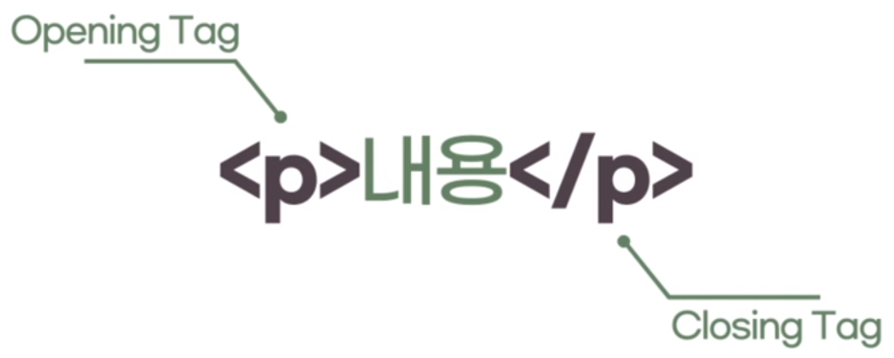
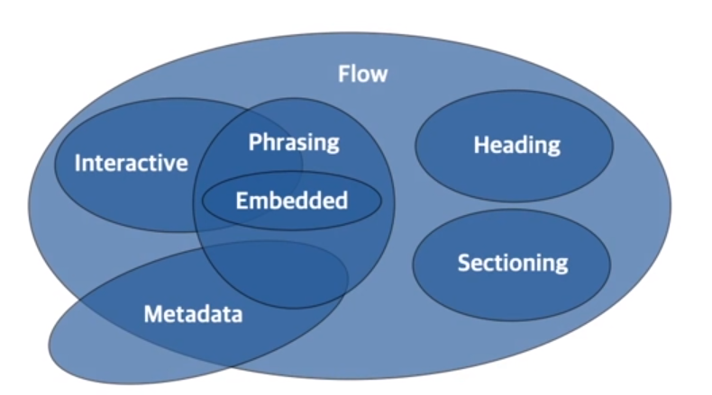

## HTML이란?

### 1. HTML은 어떻게 생겼을까

- 웹 페이지를 구성하고 있는 요소(element)를 "태그"라는 표기법으로 작성
- 태그를 통해 제목, 본문, 이미지, 비디오 등 어떤 요소인지를 명시
- 태그의 이름은 HTML5 웹 표준에 맞게 작성
- 태그는 대소문자를 구분하진 않지만, HTML5에서는 모두 **소문자**로 작성하는 것을 권장



> **1. 여는 태그(Opening tag) :** <요소의 이름>  
> **2. 닫는 태그(Closing tag) :** </요소의 이름>  
> **3. 내용(Content) :** 요소의 내용  
> **4. 요소(Element) :** 여는 태그, 닫는 태그, 내용을 통틀어 이르는 말

### 2. 빈 요소

- **빈 요소(Empty element) :** 내용이 없는 요소(ex. 이미지, 수평선, 줄바꿈)

  📎 닫는 태그를 추가로 명시하지 않아도 된다.

  📎 태그의 끝에 /를 작성해줄 수 있다.(ex. `<br />`) ⇒ 일관성 있게 사용하자!

```html
<hr />
<br />

```

### 3. 요소의 중첩

- 요소 안에 다른 요소가 들어가는 **포함관계**를 성립할 수 있다.
- 여러 요소가 중첩될 경우, 열린 순서의 **반대로** 닫혀야 한다.
- 포함관계의 구분을 위해 **들여쓰기**를 사용한다.

```html
<ul>
  <li>하나</li>
  <li>둘</li>
  <li>셋</li>
</ul>
```

### 4. 주석

- **주석(Comments)** : 브라우저가 무시하는 코드

  📎 목적 : 코드에 메모를 추가하거나, 사용하지 않는 코드를 임시로 처리하기 위함

```html
<!-- 안녕하세요 -->
<!-- <h1> 안녕 </h1> -->
```

### 5. HTML 문서의 구조

```html
<!DOCTYPE html>
<html>
  <head>
    <!-- head 영역-->
  </head>
  <body>
    <!-- body 영역-->
  </body>
</html>
```

> `<!DOCTYPE html>` : html5 문서임을 소개, 없어도 가능하지만 과거에 명시하던 습관이 고착되어 작성  
> `<html>` : 페이지 전체의 컨텐츠를 감싸는 루트(root) 요소  
> `<head>` : 웹브라우저 화면에 직접적으로 나타나진 않는 웹페이지의 정보  
> `<body>` : 웹브라우저 화면에 나타나는 모든 콘텐츠

### 6. HEAD 태그

- head mdn : [https://developer.mozilla.org/ko/docs/Web/HTML/Element/head](https://developer.mozilla.org/ko/docs/Web/HTML/Element/head)
- **head 태그 :** 기계가 식별할 수 있는 문서 정보를 담는 곳

  📎 `<title>` : 페이지 상단에 나오는 제목과 같음

### 7. BODY 태그

- body mdn : [https://developer.mozilla.org/ko/docs/Web/HTML/Element/bod](https://developer.mozilla.org/ko/docs/Web/HTML/Element/body)

### 8. 태그를 구분짓는 특성

1. **구획을 나누는 태그**
   - 단독으로 사용했을 때에는 눈에 보이지 않는다.
   - 여러가지 요소들을 묶어서 그룹화
2. **그 자체로 요소인 태그**
   - 단독으로 사용했을 때에도 눈으로 확인할 수 있다.

### 9. 블록과 인라인

1. **블록(Block)**
   - 블록 레벨 요소는 언제나 새로운 줄에서 시작하고, 좌우 양쪽으로 최대한 능러나 가능한 모든 너비를 차지한다.
   - 상자를 아래로 쌓는 것!
2. **인라인(Inline)**
   - 인라인 요소는 줄의 어느 곳에서나 시작할 수 있다.
   - 바로 이전 요소가 끝나는 지점부터 시작하여, 요소의 내용 만큼만 차지한다.

> **📦포함 규칙**
>
> - 같은 형태의 다른 요소를 안에 포함할 수 있다. (블록 > 블록, 인라인 > 인라인)
> - 대부분의 블록 요소는 다른 인라인 요소도 안에 포함할 수 있다.
> - 인라인 요소는 블록 요소를 포함할 수 없다.

### 10. 콘텐츠 카테고리

- HTML5 부터 비슷한 특징을 가진 요소끼리 묶어서 7가지 카테고리로 세분화
- 하나의 HTML 요소가 여러 콘텐츠 카테고리 내의 포함관계에 들어갈 수도 있다.

| 이름                                    | 설명                                                                                      |
| --------------------------------------- | ----------------------------------------------------------------------------------------- |
| 메타데이터 콘텐츠 (Metadata Content)    | 문서의 메타 데이터(정보), 다른 문서를 가리키는 링크 등을 나타내는 요소                    |
| 플로우 콘텐츠 (Flow Content)            | 웹 페이지 상에 메타데이터를 제외하고 거의 모든 요소, 보통 텍스트나 임베디드 콘텐츠를 포함 |
| 섹션 콘텐츠 (Section Content)           | 웹 문서의 구획(Section)을 나눌 때 사용                                                    |
| 헤딩 콘텐츠 (Heading Content)           | 섹션의 제목(heading)과 관련된 요소                                                        |
| 프레이징 콘텐츠 (Phrasing Content)      | 문단에서 텍스트를 마크업 할 때 사용                                                       |
| 임베디드 콘텐츠 (Embedded Content)      | 이미지나 비디오 등 외부 소스를 가져오거나 삽입할 때 사용되는 요소                         |
| 인터렉티브 콘텐츠 (Interactive Content) | 사용자와의 상호작용을 위한 컨텐츠 요소                                                    |


