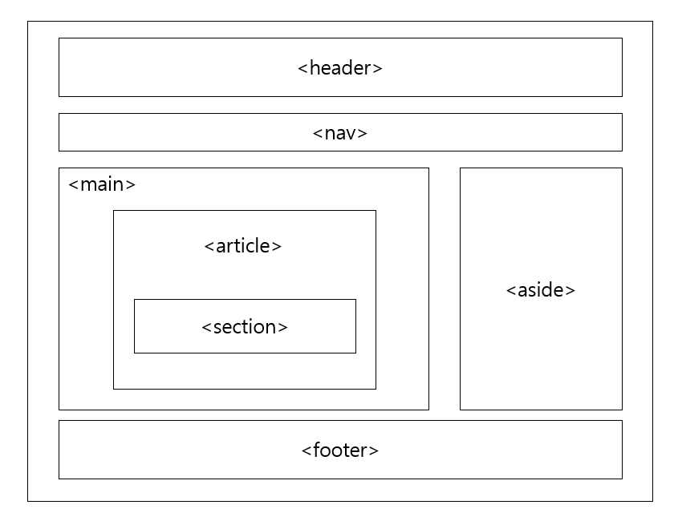

## 구조를 나타내는 요소

### 1. 컨테이너 (div, span)

- **`<div>` :** 구획을 나누는 블록 컨테이너 요소

  📎 내용이 없으면 아무것도 표현되지 않는다. ⇒ 의미를 가지고 있지 않다.

  📎 스타일링을 위해 주로 사용

- **`<span>` :** 구획을 나누는 인라인 컨테이너 요소

  📎 마찬가지로 의미를 가지고 있지 않다.

```html
<!DOCTYPE html>
<html lang="ko">
<head>
</head>
<body>
	<div>hi<div>
	<span>hello<span>
</body>
</html>
```

### 2. 시멘틱 웹이란

- **Semantic :** 의미의, 의미론적인
- 요소의 의미를 고려하여, 구조를 설계하고 코드를 작성한다.
- `<div>`태그와 `<span>`태그는 non-semantic
- 의미론적인 마크업의 이점

  📎 검색 엔진에서 웹 페이지를 탐색할 때 정보 수집에 유용

  📎 스크린리더로 페이지를 탐색할 때 푯말로 사용 가능

  📎 유지보수에 용이

### 3. header, footer

- **`<header>` :** 소개 및 탐색에 도움을 주는 콘텐츠 (ex. 제목, 로고, 검색 폼 등)

  📎 `<header>`태그 안에 `<header>`태그와 `<footer>`태그는 올 수 없다.

- **`<footer>` :** 가장 뒤쪽에 오는 콘텐츠 (ex. 연관 사이트, 단체 소개, 연락처, 저작권 관련 문구 등)

  📎 `<footer>`태그 안에 `<header>`태그와 `<footer>`태그는 올 수 없다.

### 4. nav

- **`<nav>` :** 문서의 부분 등 현재 페이지 내, 또는 다른 페이지로의 링크를 보여주는 구획(ex. 메뉴, 목차, 색인 등)

### 5. aside

- **`<aside>` :** 문서의 주요 내용과 간접적으로 연관된 부분(ex. 사이드바)

  📎 없어도 크게 영향을 주지 않는 요소들

### 6. main

- **`<main>` :** `<body>`내의 주요 콘텐츠

  📎 딱 하나만 사용 가능

  📎 internet Explorer 지원 X, 지원해야할 땐 `role="main"`속성 추가

### 7. article

- **`<article>` :** 독립적으로 구분이 가능해서 배포하거나 재사용할 수 있는 구획(ex. 매거진, 뉴스, 기사 등)

  📎 여러 개 사용 가능, `<section>`과 함께 사용 가능

### 8. section

- **`<section>` :** 단독적인 콘텐츠가 될 수 없는 구획

  📎 `<div>`는 스타일링을 위해, `<section>`은 호흡이 끊겨서 바뀌는 부분에 사용

  📎 heading 태그로 제목을 붙이는 게 좋다.


